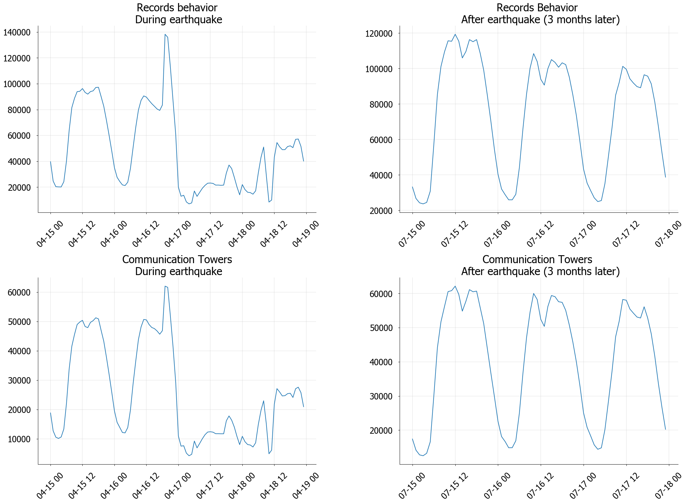
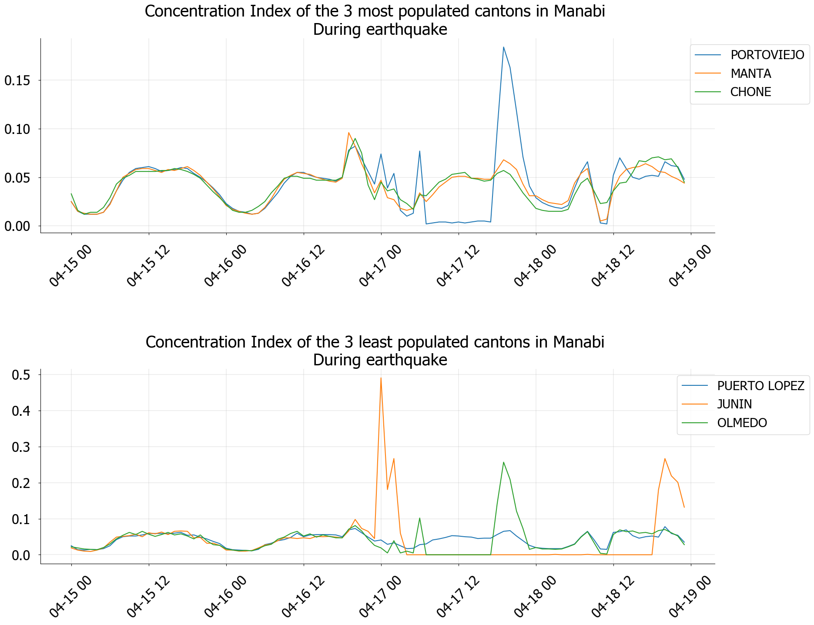
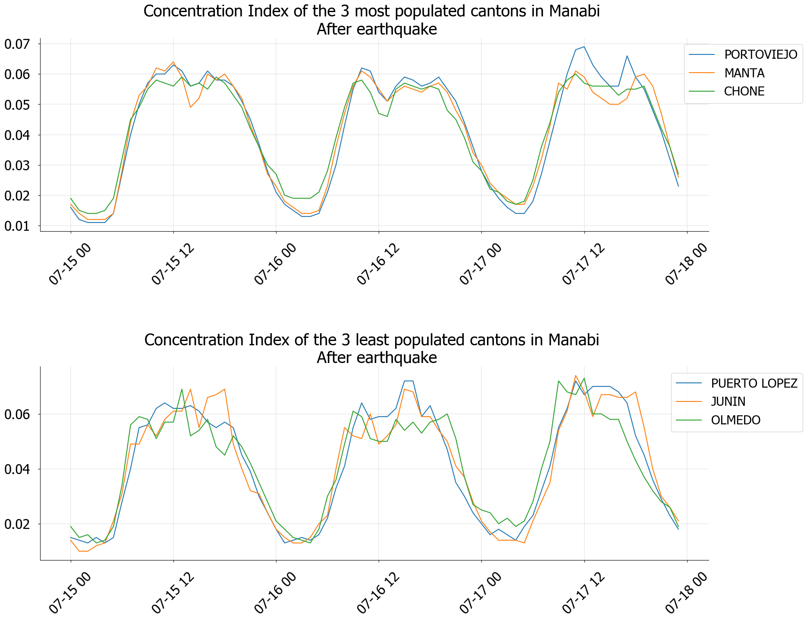

### Work in process  {style=text-align:center}

For a long time, It has been tried to study how natural disasters affect certain characteristics of a country. A characteristic very commonly affected when a natural disaster occurs is the geographic distribution of the affected areas and their surroundings. In this research, We're estimating some metrics using _Movistar Phone Data_ such as Concentration Index and Resilience Index. These metrics could use like risk indicators in Ecuador. After of this, we focus to predict which is the most affected canton using several Machine Learning techniques.

In the following graph, we show a general analysis using records behavior and communication towers. We separated the graph into 2 parts: **During the earthquake and after this**. Records behavior is based in user records and communication towers in the active towers. April 15 to 18 corresponds to the period during the earthquake, while July 15 to 17 belong earthquake later period.

And in these graphs, we show the Concentration Index of the most and less populated cantons of Manabi.

# To be continued... {style=text-align:center}
# Stay tuned for new updates! {style=text-align:center}