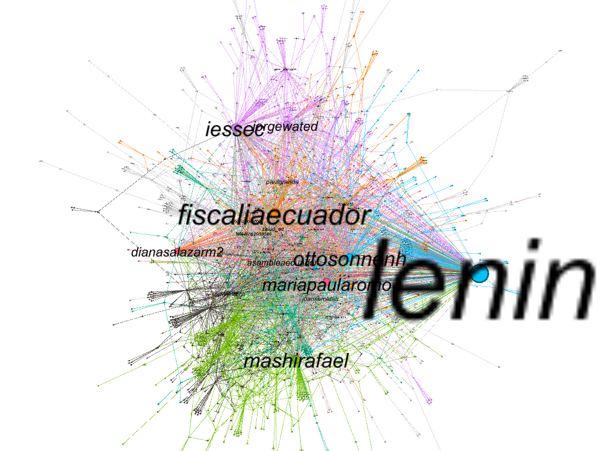
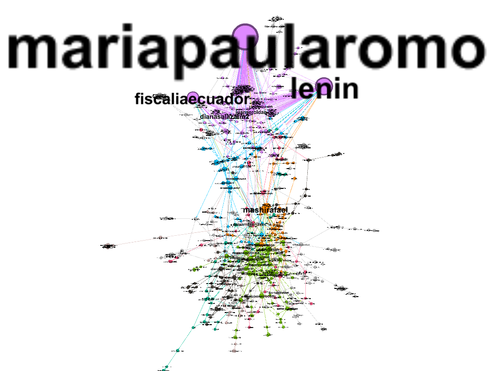

I made a Social Network Analysis using _Twitter Data_ from 2020-04-01 to 2020-07-15 and used hashtags such as: _#corrupcionecuador_, _#iess_, _#danielsalcedo_ and others. In this analysis, I wanted to analyze the behavior of people on Twitter regarding corruption cases in Ecuador and discover which were the groups that dominated this topic on Twitter. I also used a Centrality Metric like **"Eigen Centrality"** and the Modularity as a metric for clustering.

### Network by clusters {style=text-align:center}

The nodes and text size are based in the Eigen Centrality value; the links between nodes represent the number of mentions in a tweet. Also, the nodes color is based on the modularity metric. And using this clustering metric I found 20 clusters. As you can see, the main clusters are about state prosecutor's office, government, political parties, hospitals, statal assembly, TV channels.

Moreover, the main nodes in the network are:
- State prosecutor's office
  * Fiscalia Ecuador
  * Diana Salazar
- Hospitals
  * IessEc
  * Jorge Wated
- Government
  * Otto Sonnenholzner
  * Maria Paula Romo 
  * Juan Sebastián Roldán
  * Lenin
- Political parties
  * Mashi Rafael
- Statal assembly
  * Asamblea Ecuador
- TV channels
  * Teleamazonas

A few days later, I made a similar analysis but I used the hashtag #QuienRepartioLosHospitales, and this new data was from 2020-08-13 to 2020-08-16. During these days there were many corruption accusations directed to the Minister of Government (**Maria Paula Romo**) and caused that the main actor from the network change.

### Network by clusters {style=text-align:center}

As you can see, in the network there are 2 groups that dominate the discussion on twitter on these days. The first group is in top of graph and its principal actors are Maria Paula Romo, Lenin, Fiscalia Ecuador. The second group is the bottom and its principal actors are Rafael Correa and many TV channels.

