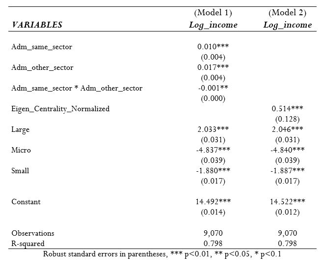
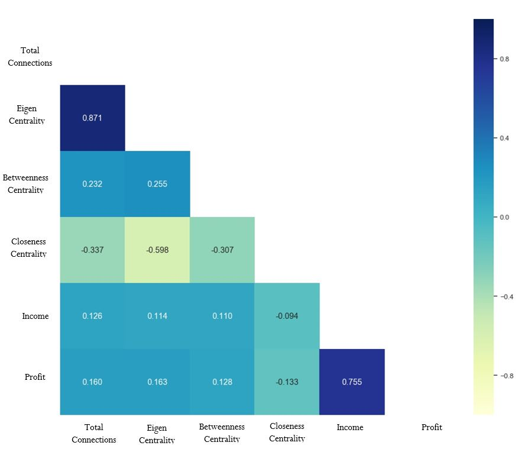
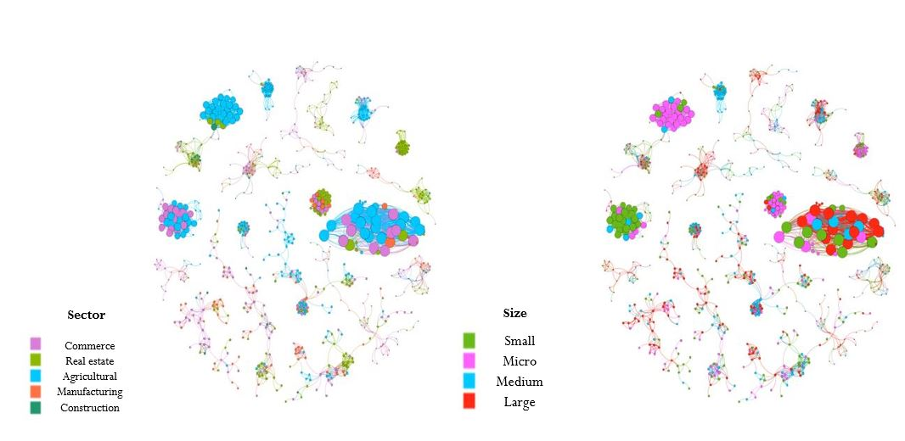

### **Some Insights**
---------------
### Result table {style=text-align:center}

### Correlation Matrix of features {style=text-align:center}

### Clustering {style=text-align:center}

{}
Click the *Cite* button above to demo the feature to enable visitors to import publication metadata into their reference management software.
{}

{}
Click the *Slides* button above to demo academia's Markdown slides feature.
{}

